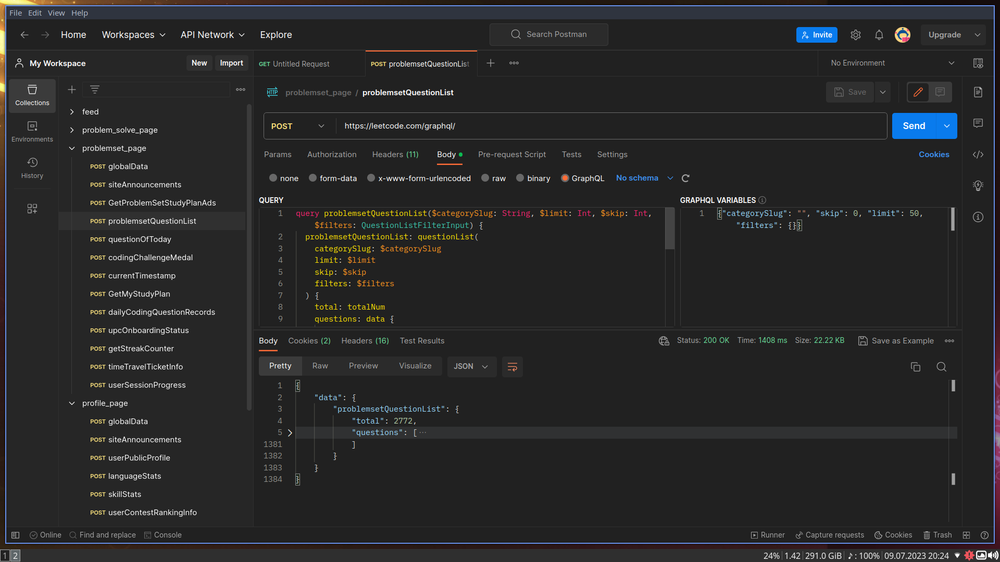

# Leetcode webpage GraphQL queries

These leetcode GraphQL queries can help you get the various data from the leetcode's GraphQL endpoint.
[https://leetcode.com/graphql](https://leetcode.com/graphql)


### Quickstart:

```
curl --location 'https://leetcode.com/graphql/' \
--header 'Content-Type: application/json' \
--header 'Cookie: LEETCODE_SESSION=<LEETCODE_SESSION>; csrftoken=<csrftoken>' \
--data '{"query":"query problemsetQuestionList($categorySlug: String, $limit: Int, $skip: Int, $filters: QuestionListFilterInput) {\n  problemsetQuestionList: questionList(\n    categorySlug: $categorySlug\n    limit: $limit\n    skip: $skip\n    filters: $filters\n  ) {\n    total: totalNum\n    questions: data {\n      acRate\n      difficulty\n      freqBar\n      frontendQuestionId: questionFrontendId\n      isFavor\n      paidOnly: isPaidOnly\n      status\n      title\n      titleSlug\n      topicTags {\n        name\n        id\n        slug\n      }\n      hasSolution\n      hasVideoSolution\n    }\n  }\n}","variables":{"categorySlug":"","skip":0,"limit":50,"filters":{}}}'
```

> **Note:** For authenticated requests make sure you add `LEETCODE_SESSION` and `csrftoken` cookies with the request.

### Repo contains two types of files

- `*.postman_collections.json`: Postman collection is directly importable in [Postman App](https://www.postman.com/downloads/).

- `*.graphql`: GraphQL queries in plain text. Query is followed by `variables` wherever applicable.

```graphql
query problemsetQuestionList($categorySlug: String, $limit: Int, $skip: Int, $filters: QuestionListFilterInput) {
  problemsetQuestionList: questionList(
    categorySlug: $categorySlug
    limit: $limit
    skip: $skip
    filters: $filters
  ) {
    total: totalNum
    questions: data {
      acRate
      difficulty
      freqBar
      frontendQuestionId: questionFrontendId
      isFavor
      paidOnly: isPaidOnly
      status
      title
      titleSlug
      topicTags {
        name
        id
        slug
      }
      hasSolution
      hasVideoSolution
    }
  }
}
{"categorySlug": "", "skip": 0, "limit": 50, "filters": {}}
```

